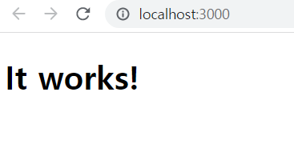
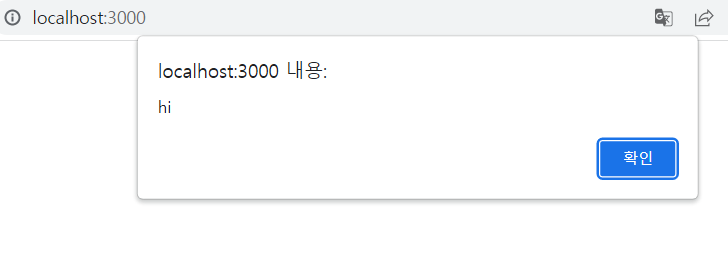

# Zoom
Zoom Clone Using NodeJS, WebRTC and Websockets.


## 0.1 Requirements

백엔드: ExpressJS, app.get(), Pug, (req, res) =>

프론트엔드: 바닐라 JS

node.js 설치


## 0.2 Server Setup

`mkdir zoom`

`cd zoom`

`npm init -y`

`code .`


package.json

```json
{
  "name": "zoom",
  "version": "1.0.0",
  "description": "Zoom Clone using NodeJS, WebRTC and Websockets.",
  "license": "MIT"
}
```


`npm i nodemon -D`


babel.config.json

nodemon.json

src/server.js

파일 생성


`git init .`

`npm i @babel/core @babel/cli @babel/node -D`


.gitignore 생성

```.gitignore
/node_modules
```


nodemon.json

```json
{
    "exec": "babel-node src/server.js"
}
```

nodemon은 "exec"명령어(key)를 이용해서 server.js를 실행시킴

src/server.js에 대해 babel-node 명령문을 실행시키는 것


`@babel/preset-env -D`

babel.config.json

```json
{
  "presets": ["@babel/preset-env"]
}
```


package.json

```json
"scripts": {
    "dev": "nodemon"
  },
```

"dev"는 nodemon 호출. nodemon이 호출되면 nodemon.json을 살펴보고 거기있는 코드 실행


`npm install express`

`npm install pug`


src/server.js

```javascript
import express from "express";
const app = express();
console.log("hello");
app.listen(3000);
```

app은 console.log("hello")를 실행하고 포트 3000을 listen해 줄거다


`npm run dev`


**에러**

npm run dev 시,

1[Error [ERR_REQUIRE_ESM\]: require() of ES Module not supported

=> The current version of `node-fetch` is ONLY compatible with an ESM import (using `import`), not from CommonJS modules using `require()`.

**해결**

그래서 node-fetch 구버전으로 다운그레이드 하거나 `package.json`에 `{"type": "module"}` 추가해주면 해결. 두 가지 방법 다 써봤는데 안되서 프로젝트 재생성하고 type module 추가해줬더니 됐다. 

2 nodemon은(는) 내부 또는 외부 명령, 실행할 수 있는 프로그램, 또는 배치 파일이 아닙니다.

**해결**

=> 폴더 삭제 후 재생성

원인을 모르겠다. 이전과 달랐던 건 `npm i @babel/core @babel/cli @babel/node @babel/preset-env -D` 이걸 한번에 해준 죄밖에,,,


## 0.3 Frontend Setup

static files, 유저들에게 가게 될 파일 만들기 

webpack 안씀. 자바스크립트 유저에게 보내고 브라우저가 이해할 수 있게 만들 것


src/js/app.js 생성


pug 페이지들을 렌더하기 위해 설정

src/views/home.pug 생성

html5

src/views/home.pug

```html
doctype html
html(lang="en")
  head
    meta(charset="UTF-8")
    meta(http-equiv="X-UA-Compatible", content="IE=edge")
    meta(name="viewport", content="width=device-width, initial-scale=1.0")
    title Noom
  body 
  h1 It works!
```


src/server.js

```javascript
import express from "express";

const app = express();

app.set("view engine", "pug");
app.set("views", __dirname + "/src/views");

const handleListen = () => console.log(`Listening on http://localhost:3000`);
app.listen(3000, handleListen);
```


`npm run dev`

**에러**

1 ReferenceError: __dirname is not defined in ES module scope

2 [nodemon] app crashed - waiting for file changes before starting...

**해결**

server.js 최상단에 추가

```javascript
import path from 'path';
const __dirname = path.resolve();
```


우리가 사용할 유일한 route 만들기

home으로 가면 request, response를 받고 -> res.render(우리가 만든 home 렌더)

src/server.js

```javascript
app.get("/", (req, res) => res.render("home"));
```


Express로 하는 일

별로 없음. views 설정, render 끝. 나머지는 websocket에서 실시간으로 일어날 것. 


`npm run dev`

페이지 render




home에 script 추가

src/views/home.pug

```html
  body 
  h1 It works!
  script(src="/public/js/app.js") 
```

http://localhost:3000/public/js/app.js 이 url 아직 작동 안함.


static 작업 해줘야 함.

src/server.js

```javascript
// user가 /public으로 가게되면 __dirname + "/public" 폴더를 보여주게 한다.
app.use("/public", express.static(__dirname + "/src/public"));
```

**에러**

`app.use("/public", express.static(__dirname + "/public"));` 이랬더니 404에러 떴었음. /src 붙여서 **해결**


유저한테만 보여지는 FrontEnd에 사용되는 <u>app.js</u>를 저장할 때마다 nodemon이 restart되고 있음. 이걸 원하지 않음. <u>views나 서버</u>를 수정할 때만 nodemon이 재시작(새로고침)되길 원함. FrontEnd 자바스크립트를 수정할 때는 nodemon이 새로고침하지 않으면 좋겠음. 

=> nodemon에서 폴더 하나 무시할 것

nodemon.json

```javascript
{
  "ignore": ["src/public/*"],
}
```

=> 서버 저장할 때만 재시작 됨.


node.js 설정 정리

```javascript
app.set("view engine", "pug");
app.set("views", __dirname + "/src/views");
app.use("/public", express.static(__dirname + "/src/public"));
app.get("/", (req, res) => res.render("home"));
```

- Pug로 view engine 설정
- Express에 template이 어디 있는지 지정
- public url을 생성해서 유저에게 파일 공유
- home.pug를 render 해주는 route handler 만듬

Express 끝!


나머지는 다음 섹션에서 websocket으로 다룰 거고, 지금부턴 real-time(실시간)으로 할 것


버튼 만들기

mvp css -> 기본 html tag들 이쁘게 만들어줌

`<link rel="stylesheet" href="https://unpkg.com/mvp.css">`

기본 화면

src/views/home.pug

```html
doctype html
html(lang="en")
  head
    meta(charset="UTF-8")
    meta(http-equiv="X-UA-Compatible", content="IE=edge")
    meta(name="viewport", content="width=device-width, initial-scale=1.0")
    title Noom
    link(rel="stylesheet", href="https://unpkg.com/mvp.css")
  body
    header  
      h1 Noom
    main 
      h2 Welcome to Noom!
    button Call
    script(src="/public/js/app.js") 
```


src/public/js/app.js

```javascript
alert("hi");
```



=> 자바스크립트 FrontEnd로 잘 보내짐.


## 0.4 Recap(요약)

**개발환경 구축**

- Nodemon

  - nodemon.json

  ```json
  {
    "ignore": ["src/public/*"],
    "exec": "babel-node src/server.js"
  }
  ```

  - 우리 프로젝트를 살펴보고 변경 사항이 있을 시 서버를 재시작해주는 프로그램
  - 서버를 재시작하는 대신에 babel-node를 실행하게 된다. Babel은 우리가 작성한 코드를 일반 NodeJs 코드로 컴파일 해주는데 그 작업을 src/server.js 파일에 해준다. 

- server.js

  ```javascript
  import express from "express";
  import path from 'path';
  
  const __dirname = path.resolve();
  const app = express();
  
  app.set("view engine", "pug");
  app.set("views", __dirname + "/src/views");
  // public 폴더를 유저에게 공개
  // 즉, user가 /public으로 가게되면 __dirname + "/public" 폴더를 보여주게 한다.
  app.use("/public", express.static(__dirname + "/src/public"));
  app.get("/", (req, res) => res.render("home"));
  app.get("/*", (req, res) => res.redirect("/"));
  
  const handleListen = () => console.log(`Listening on http://localhost:3000`);
  app.listen(3000, handleListen);
  ```

  

  - express를 import하고, express 어플리케이션을 구성
  - view engine을 Pug로 설정하고, views 디렉토리가 설정됨
  - public 파일들에도 똑같은 작업. public 파일들은 FrontEnd에서 구동되는 코드고 아주 중요한 부분. public 폴더를 유저에게 공개. 유저들이 서버 내 모든 폴더 보면 보안상 문제. 따라서 유저가 볼 수 있는 폴더를 따로 지정해준 것.
  - 홈페이지로 이동시 사용될 템플릿 렌더해줌
  - catchall url. 유저가 어떤 url을 입력하던지 home으로 돌려보냄
